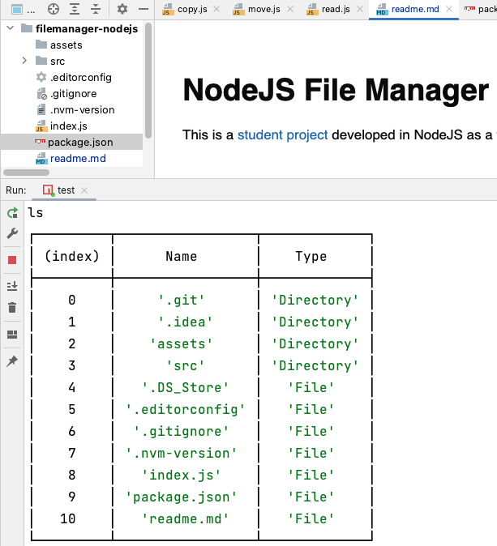

# NodeJS File Manager

This is a [student project](https://github.com/AlreadyBored/nodejs-assignments/blob/main/assignments/file-manager/assignment.md) developed in NodeJS as a file manager. It was created as part of the curriculum for the [RS School](https://rs.school/).

## Features

- Browse and navigate through directories
- View file and directory information
- Create new directories
- Rename files and directories
- Delete files and directories
- ect

### Supported commands



- `ls`
- `up`
- `cd path_to_directory`
- `cat path_to_file`
- `add new_file_name`
- `rn path_to_file new_filename`
- `cp path_to_file path_to_new_directory`
- `mv path_to_file path_to_new_directory`
- `rm path_to_file`
- `hash path_to_file`
- `compress path_to_file path_to_destination`
- `decompress path_to_file path_to_destination`
- `os --EOL`
- `os --cpus`
- `os --homedir`
- `os --username`
- `os --architecture`

## Installation

1. Clone the repository:

```bash
git clone git@github.com:andron13/filemanager-nodejs.git
```

2. Change to the project directory:

```bash
cd filemanager-nodejs
```

## Usage

1. Start the filemanager:

```bash
npm run start -- --username=your_username
```

## Technologies Used

- NodeJS

## License

This project is licensed under the [MIT License](https://opensource.org/licenses/MIT). Feel free to modify and use it according to your needs.


